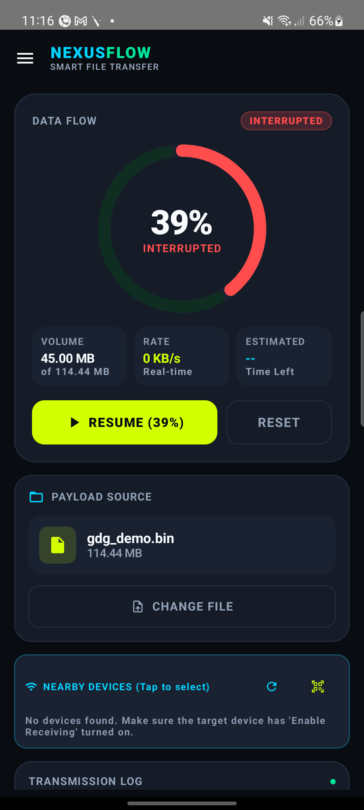
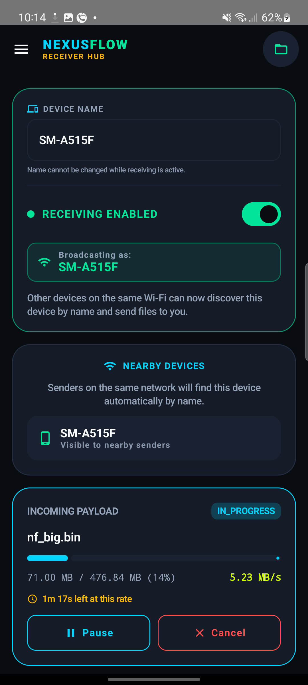
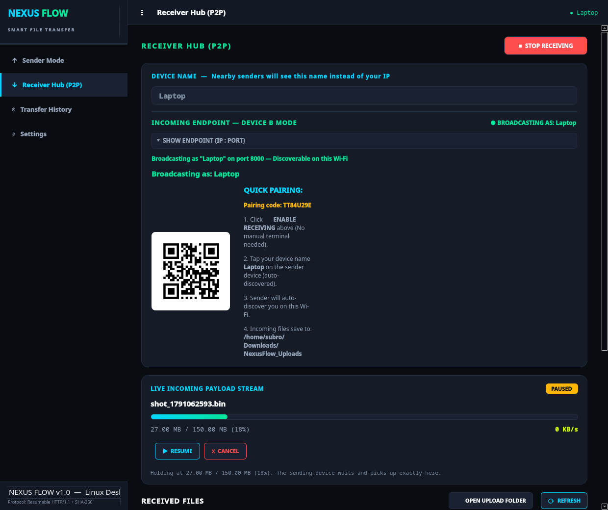
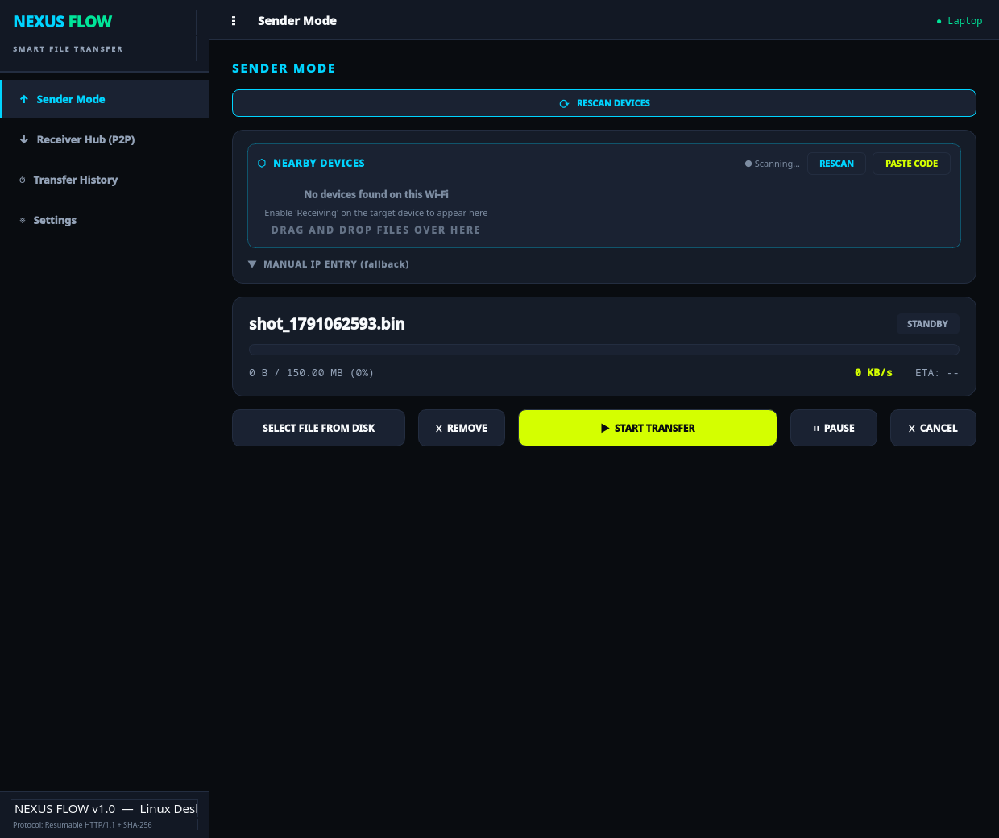
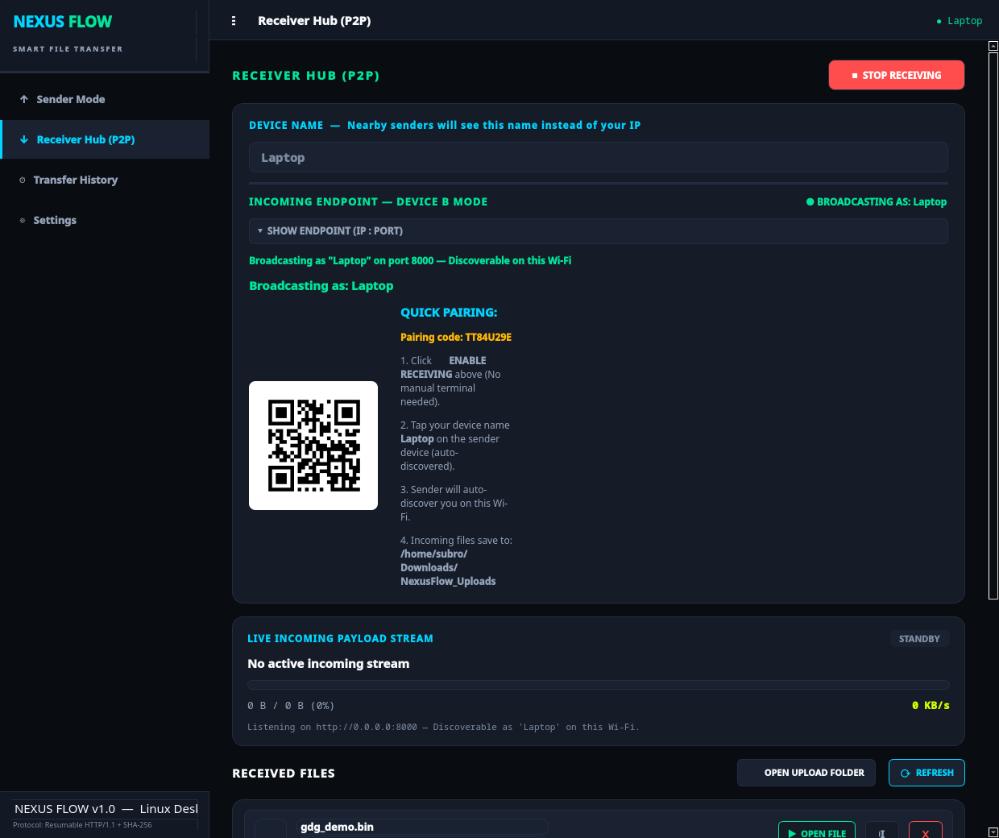
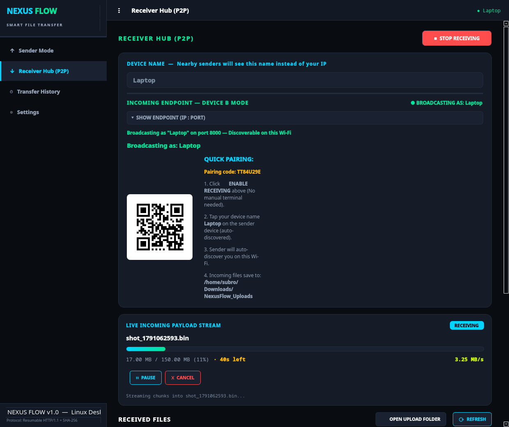
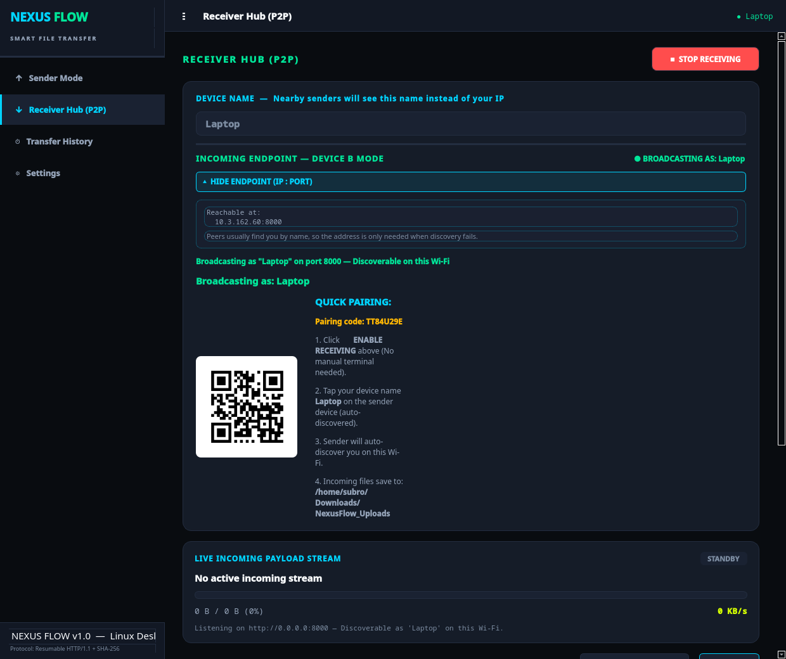
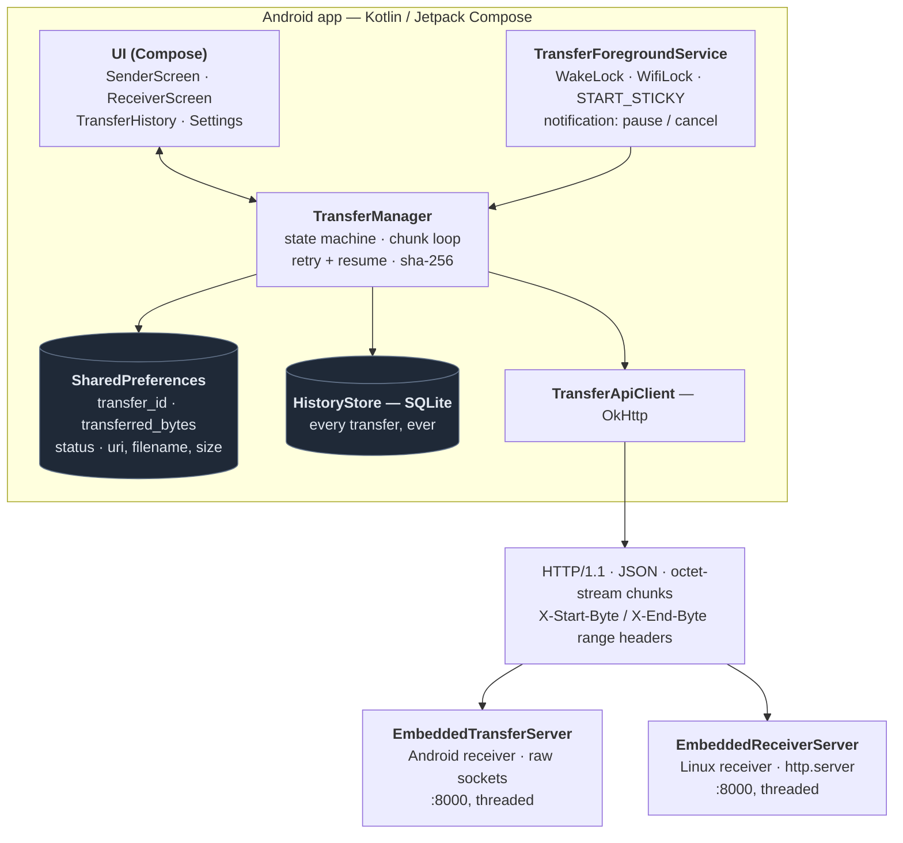

# NEXUS FLOW — Resumable File Transfer

An Android app that transfers large files over a local network and survives
everything that normally ruins a transfer: Wi-Fi dropping, the app being killed
mid-file, a chunk request being answered twice, or the other device changing
its mind halfway through.

Built for **GDG on Campus, SRM — Recruitments 2026-27, Technical Domain, App
Development: "Resumable File Transfer"**. A Linux desktop client ships in this
repository as an extra peer for cross-platform testing.

<p align="center">
  
  
  
</p>

### The Linux client

The desktop app is a full peer, not a stub: the same protocol, the same resume
offsets, the same pause/resume/cancel controls.

<p align="center">
  
  
  
</p>

<p align="center">
  
  
</p>

Regenerate these with `python capture_screenshots.py` — it drives the real
window through a real transfer and a real pause, so the screenshots cannot drift
from the code the way hand-taken ones do.

---

## Quick start

```bash
# 1. Build the APK
cd android && ./gradlew assembleDebug
#    -> android/app/build/outputs/apk/debug/app-debug.apk

# 2. Install it
adb install -r -d android/app/build/outputs/apk/debug/app-debug.apk
```

Prebuilt artifacts, so nothing has to be built to try it:

| | |
|---|---|
| **`app-release/NexusFlow-debug.apk`** | The Android app. Debug-signed. |
| **`app-release/NexusFlow-Linux-x86_64.tar.gz`** | The Linux client, a second endpoint of the same protocol. |

> Debug-signed: `adb install -r -d app-release/NexusFlow-debug.apk`. No release
> keystore is configured in this repository; see *Known limitations*.

**Send a file:** open the app, pick a device under *Nearby Devices*, select a
file, press **START TRANSFER**.

**Pairing by QR:** the receiving device shows a pairing code in the Receiver Hub;
the sending device taps **Scan QR** (next to *Nearby Devices*) and the camera
decodes it. The code carries the device *name*, not an address — `nexus://receive/<name>` — because a QR gets photographed and sent over chat, and neither should hand over a LAN IP. The sender resolves the name over mDNS. A keyboard button sits beside the scan button for devices whose camera is unusable.

**Receive a file:** open *Receiver Hub*, enable receiving, and send to the
device from any other device on the same network.

There is also a mock receiver so a single phone is enough to demonstrate
everything: open *Settings → Receiver → Demo Throttle Simulator*.

---

## Architecture



Both receivers speak the same protocol (`docs/protocol.md`), so any phone can
send to any phone or to the Linux client, and the Linux client can send to a
phone.

### Design decisions

**The server owns the offset.** The client never assumes how much landed. Before
uploading it asks `GET /transfer/{id}/status` and continues from
`received_bytes`. This is what makes resume correct after a crash, where the
client's own bookkeeping is exactly what cannot be trusted.

**Chunks are written by absolute offset.** `X-Start-Byte` / `X-End-Byte` are
range headers and the receiver seeks before writing, so chunk *n* can arrive at
any time, in any order, more than once. Nothing is appended, so a duplicate
request is a no-op rather than corruption.

**Sequential, one at a time.** Transfers run in a single coroutine, one at a
time. A phone's Wi-Fi radio does not get faster by interleaving two 1 MB
uploads, and a serial queue makes the resume logic tractable. Queued batches from
the Sharesheet are sent one after another.

**The queue is persisted, not just held in memory.** A batch's URIs are stored in
order *together with which item is next* -- restoring the files without the
position would silently resend from the top. A single `LaunchedEffect` watches the
queue state, so none of the mutation sites can forget to save. On a cold start the
queue is rebuilt the same way an interrupted transfer is, and entries whose staged
copy Android reclaimed from `cacheDir` are dropped rather than offered. `QUEUED` is
a real state in the enum, not an implicit one.

---

## Transfer protocol

Full specification: **[`docs/protocol.md`](docs/protocol.md)**.

| Step | Request | Purpose |
|---|---|---|
| 1 | `GET /health` | Is the peer alive? |
| 2 | `POST /transfer` | Open a session: `{filename, filesize, checksum, chunk_size}` → `transfer_id` |
| 3 | `POST /transfer/{id}/chunk` | Upload bytes with `X-Start-Byte` / `X-End-Byte` / `X-Total-Size` |
| 4 | `GET /transfer/{id}/status` | Ask what actually landed (the resume primitive) |
| 5 | `POST /transfer/{id}/cancel` | Abandon the session; the partial is deleted |

A chunk can also be **refused on purpose**, which is what powers the pause and
cancel buttons:

| Status | Body | Meaning |
|---|---|---|
| `409 Conflict` | `{"detail":"transfer_paused"}` | The receiver is holding this transfer. Do not retry. |
| `410 Gone` | `{"detail":"transfer_cancelled"}` | The receiver ended it. Do not retry. |

Senders map these onto a distinct `PAUSED` / `CANCELLED` outcome rather than a
network failure — otherwise a deliberate user action on the other device would be
reported as a connection error.

---

## Persistence strategy

State lives in two places, with different jobs.

**SharedPreferences — the live transfer and the queue.** The session id, the URI,
filename, size, peer, transferred byte count and status are written on every
progress emission (rate-limited to once a second; always for a terminal status).
The queue's ordered URIs and its current position live here too. This is what lets
a killed app come back to a real percentage, and its queue intact, instead of an
empty screen.

**SQLite (`HistoryStore`) — every transfer, ever.** Device-local, cumulative,
and separate from the live session. A finished transfer is history; it must not
be coupled to whichever peer happens to be selected.

On a cold start the app calls `restoreSession()`. If a session was in flight it
rebuilds the card and reports it as **INTERRUPTED** — never as whatever status it
had when the process died, because a transfer that was mid-flight is not
running, and claiming otherwise is how an app shows a completed transfer that
never happened.

### Verified end to end

Killed with `adb shell am force-stop` mid-transfer, then reopened:

```
prefs at the moment of the kill:
  transfer_status             = TRANSFERRING
  transfer_transferred_bytes  = 47185920
  transfer_id                 = b6abd0f4dc1905bd

after reopening:
  39%  INTERRUPTED   ·   button: "RESUME (39%)"   ·   file still bound

after tapping RESUME:
  continued from the receiver's 50331648 offset — not from 0
  120000000 / 120000000   completed   sha256_verified = true
  received file SHA-256 identical to the source
```

---

## Retry and recovery

| Failure | What happens |
|---|---|
| Wi-Fi drops mid-chunk | Chunk fails; up to 2 retries with 600 ms / 1200 ms backoff |
| Retries exhausted | Status becomes `INTERRUPTED`, session id **kept**, resume continues from the confirmed offset |
| Server unreachable on start | 3 health-check attempts 600 ms apart, then `INTERRUPTED` |
| App killed / process death | `START_STICKY` restarts the service; session is rebuilt from disk |
| Screen off | Partial `WakeLock` + high-performance `WifiLock` keep the radio and CPU alive |
| Chunk response lost | Client re-asks `/status` and compares against `received_bytes`; a re-sent chunk is idempotent because writes are positional |
| Chunk corrupted in transit | SHA-256 of the finished file compared on both ends; a mismatch is `FAILED`, never `COMPLETED` |
| Receiver paused / cancelled | `409` / `410`; no retry, session id kept on pause and cleared on cancel |

A retry never destroys valid progress, and there is no unbounded loop: the retry
budget is 2 per chunk and the chunk position only advances on a confirmed
`200 OK`.

### Lifecycle

`TransferForegroundService` uses `START_STICKY` plus a partial `WakeLock` and a
`WifiLock`, so a transfer survives the screen turning off and the process being
killed under memory pressure. On Android 12+ the service is started with the
`dataSync` foreground-service type. The notification carries **pause/resume**
and **cancel** actions, so a transfer can be controlled with the app closed.

### Pause and cancel, from either side

Pause holds the current byte offset; resume continues from it. The same controls
exist on both devices:

- **On the sender:** the progress card, and the notification actions.
- **On the receiver:** the Receiver Hub card, and the receive notification.

The receiver's pause is not a UI-only flag: while paused, chunks are refused
with `409`, so the sender is *told* to hold instead of writing into a socket
nobody is reading.

---

## Edge cases handled

- **Duplicate chunk requests** — positional writes plus `max(offset, received)`
  make a replayed request a no-op.
- **Out-of-order chunks** — the receiver seeks to `X-Start-Byte`; order does not matter.
- **File renamed or moved between selection and resume** — a persisted
  content URI is validated against the session's filename and size; a mismatch
  starts a fresh session instead of corrupting one.
- **Storage permission revoked mid-transfer** — the chunk read fails and reports
  a clear message rather than a generic crash.
- **Cancel leaves no garbage** — the partial is preallocated to the full size, so
  cancelling deletes it. Otherwise a cancelled 2 GB transfer would leave 2 GB of
  zeroes that looks like a finished download.
- **A cancelled transfer never auto-resumes** — the session id is cleared, so it
  cannot come back as a paused transfer.
- **Cancellation mid-upload** — the remainder of the request is drained before
  the refusal is sent. Closing a socket with unread inbound data sends a TCP RST,
  which discards the response; draining first makes it an ordinary FIN, so the
  sender reliably learns the transfer was cancelled on purpose.
- **Receiver offline mid-file** — the session survives on the receiver; the
  transfer resumes when it returns.

---

## The Linux client

The Android app is the deliverable. The Linux client is a **second endpoint of
the same protocol**, included so the behaviour could be tested against a real
peer from both directions rather than only phone-to-phone.

* **Receiving** — the Hub shows a pairing code, and **Pause / Resume / Cancel**
  act on the live session exactly as on Android. Those controls send the same
  `409` / `410` refusals, so a paused or cancelled transfer reads the same from
  either device.
* **Sending** — chunked uploads with offset negotiation, pause/resume from
  either side, and the deliberate-refusal mapping.
* **Packaged** — a PyInstaller one-dir build (`NexusFlow.spec`). A prebuilt copy
  is committed at
  **[`app-release/NexusFlow-Linux-x86_64.tar.gz`](app-release/)**
  (~75 MB, unpack and run `./NexusFlow`). Requires a recent Python 3 runtime on
  the target machine; it is not a static binary.

Both receivers implement the same protocol, so any phone can send to any phone
or to the Linux client, and the Linux client can send to a phone.

**The most reliable way to demo across devices, on any network:**
`adb reverse tcp:8000 tcp:8000` and point the app at `127.0.0.1:8000`. It does
not depend on Wi-Fi at all, which matters because many institutional networks
isolate clients from each other — there the app correctly reports "No devices
found" rather than hanging, but a hotspot or a USB loopback is the answer.

---

## Project layout

```
android/                     Android app (Kotlin, Jetpack Compose, Material 3)
  app/src/main/java/com/resumabletransfer/app/
    TransferManager.kt       transfer state machine, chunk loop, retry, resume
    TransferApiClient.kt     HTTP client (OkHttp)
    TransferForegroundService.kt  background survival + notification actions
    MainActivity.kt          navigation, file picking, Sharesheet, cold start
    HistoryStore.kt          device-local SQLite history
    server/EmbeddedTransferServer.kt   the receive endpoint
    IncomingTransferNotifier.kt        receive notification + actions
    ui/                      Compose screens
  app/src/main/res/values-de/         German locale
desktop/                     Linux client (PyQt6) — extra peer
  app.py                     GUI: sender + receiver hub
  transfer_client.py         sender: chunking, pause/cancel, retry
  embedded_server.py         receiver: pause/resume/cancel, 409/410 contract
server/                      Standalone FastAPI receiver
docs/                        protocol, architecture, resumability, screenshots
tests/                       pytest suite + device repro scripts
```

---

## Tests

```bash
python -m pytest tests -q     # 18 passed
```

| Test | What it proves |
|---|---|
| `test_server.py` | The HTTP protocol: sessions, chunking, offsets, resume |
| `test_receiver_refusal.py` | `409`/`410` map to PAUSED/CANCELLED, and an unrelated `409` is *not* mislabelled |
| `test_receiver_hold_cancel.py` | Real sockets: pause holds, resume finishes with matching SHA-256, cancel deletes the partial |
| `test_linux_hub_controls.py` | The real Qt widgets drive a real transfer: pause stops the sender, resume completes it, cancel deletes the partial |
| `repro_cancel_race.py` | Cancelling mid-upload still yields a clean `410` |
| `repro_cancel_race_device.py` | The same race against a real phone, over real Wi-Fi |

The Android side was verified on a physical device (SM-A515F, Android 13)
against the Linux receiver: pause/resume/cancel round trips, cross-device SHA-256
verification, and the kill-and-restore sequence quoted above.

---

## Tech stack

| | |
|---|---|
| Language | Kotlin 2.0.21 |
| UI | Jetpack Compose, Material 3, bilingual (English / German) |
| Networking | OkHttp + a raw-socket embedded receiver |
| Persistence | SharedPreferences (live session), SQLite (history) |
| Background | Foreground service, `START_STICKY`, `WakeLock`, `WifiLock` |
| Linux client | Python 3, PyQt6 |

---

## Known limitations

- Sequential transfers, one at a time (a deliberate choice; see *Design decisions*).
- The queue persists across process death, but a staged copy reclaimed by Android
  from `cacheDir` cannot be recovered; that entry is dropped rather than faked.
- Sessions live in memory on the receiver, so restarting the receiver loses them.
- The receiver reuses one destination path per filename, so re-pushing an
  identical filename overwrites the earlier file.
- Debug-signed build; a release keystore is not configured in this repository.